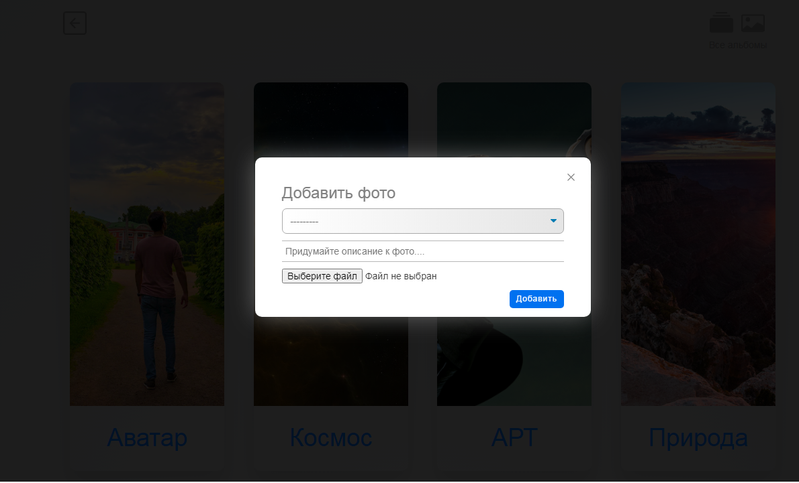
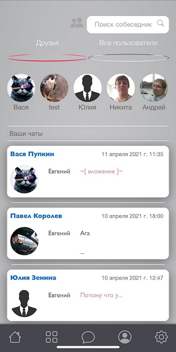
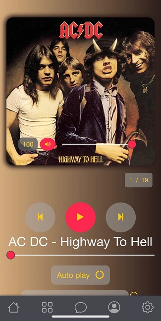
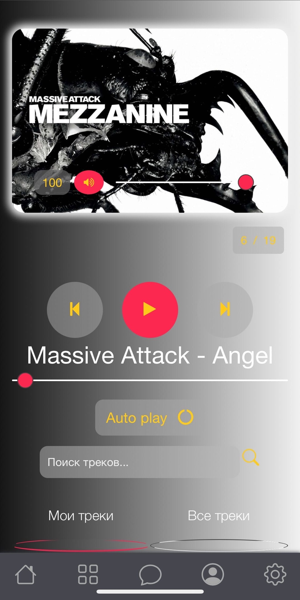

# Social-Network
<h3>О проекте</h3>
Проект представляет из себя площадку для коммуникации пользователей между собой.<br>
Социальная сеть имеет набор привычных опций, создание постов, загрузка своего контента, будь то аудио, видео или фото файлы.
<br>
<br>

<br>
<br>
<div>&nbsp&nbsp&nbsp&nbsp&nbsp&nbsp&nbsp&nbsp&nbsp&nbsp&nbsp&nbsp</div>
<br>
<br>
Любой пользователь может создать диалог с интересующим его человеком. Система проверит была ли ранее беседа с этим пользователем и переведет на диалог.
<br>
<br>

<br>
<br>
В разделе аудио реализована смена цветовой гаммы заднего фона в зависимости от обожки альбома.
<br>
<br>
<div>&nbsp&nbsp&nbsp&nbsp&nbsp&nbsp&nbsp&nbsp&nbsp&nbsp&nbsp&nbsp</div>
<br>
<br>
Под каждым объектом с контентом есть стандартный набор кнопок, это оставить голос, либо комментарий или поделиться.<br>
Если пользователя заинтересует медиаконтент другого юзера, он может его добавить в свою медиатеку.
<br>
<br>

<br>
<br>
У каждого пользователя формируется своя новостная лента с контентом, в зависимости от людей на которых он подписан и сообществ в которых он состоит. Любой пользователь может ограничивать доступ к просмотру своего контента в настройках профиля.
<h3>API</h3>
Практически 80% запросов к базе данных происходит без перезагрузки страницы, что ускоряет ответ от сервера и улучшает восприятие сайта.
В этом мне помог фреймоврк `*Django Rest Framework*`.
Для примера продемострирую фрагмент кода, который решает проеблему подгрузки последнего созданного сообщения пользователем:<br>
```python
    def get(self, request):
        chat_id = request.GET.get('chat_id')
        chat = self.modelChat.objects.filter(id=chat_id)
        message = self.modelSerializer(chat, many=True)
        logger.info('GET: ObjectRequestMessageUser, user - {0}'.format(request.user.email))
        return Response(message.data)
```
<br>
Полученные данные обрабатываем в шаблоне. Фреймовр сильно помогает в формировании API и ускоряет процесс разработки.<br>
Установка и документация описана на сайте: <br>`https://www.django-rest-framework.org/`<br>
