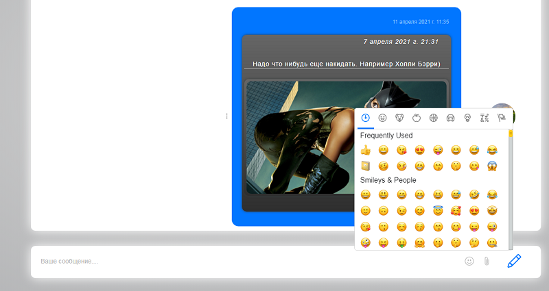
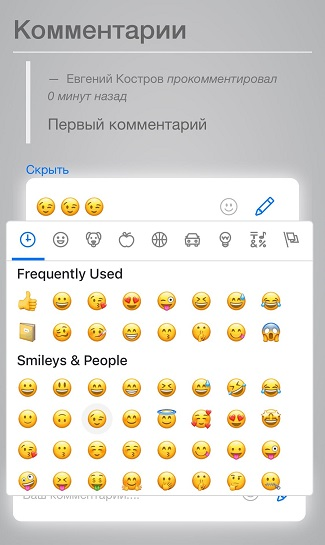
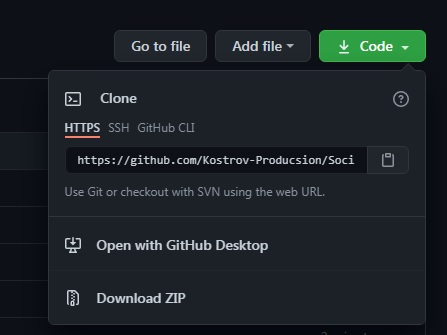

# Social-Network
### О проекте
Проект представляет из себя площадку для коммуникации пользователей между собой.<br>
Социальная сеть имеет набор привычных опций, создание постов, загрузка своего контента, будь то аудио, видео или фото файлы.
<br>
<br>

<br>
<br>
 &nbsp;&nbsp;&nbsp;&nbsp;&nbsp;&nbsp;&nbsp;&nbsp;&nbsp;&nbsp;  
<br>
<br>
Любой пользователь может создать диалог с интересующим его человеком. Система проверит была ли ранее беседа с этим пользователем и переведет на диалог.
<br>
<br>

<br>
<br>
В разделе аудио реализована смена цветовой гаммы заднего фона в зависимости от обожки альбома.
<br>
<br>
 &nbsp;&nbsp;&nbsp;&nbsp;&nbsp;&nbsp;&nbsp;&nbsp;&nbsp;&nbsp;  
<br>
<br>
Под каждым объектом с контентом есть стандартный набор кнопок, это оставить голос, либо комментарий или поделиться.<br>
Если пользователя заинтересует медиаконтент другого юзера, он может его добавить в свою медиатеку.
<br>
<br>

<br>
<br>
У каждого пользователя формируется своя новостная лента с контентом, в зависимости от людей на которых он подписан и сообществ в которых он состоит. Любой пользователь может ограничивать доступ к просмотру своего контента в настройках профиля.
### API
Практически 80% запросов к базе данных происходит без перезагрузки страницы, что ускоряет ответ от сервера и улучшает восприятие сайта.
В этом мне помог фреймоврк `Django Rest Framework`.
Для примера продемострирую фрагмент кода, который решает проеблему подгрузки последнего созданного сообщения пользователем:<br>
```python
    def get(self, request):
        chat_id = request.GET.get('chat_id')
        chat = self.modelChat.objects.filter(id=chat_id)
        message = self.modelSerializer(chat, many=True)
        logger.info('GET: ObjectRequestMessageUser, user - {0}'.format(request.user.email))
        return Response(message.data)
```
<br>
Полученные данные обрабатываем в шаблоне. Фреймовр сильно помогает формируя API и ускоряя процесс разработки.<br>
Установка и документация описана на сайте:

[django-rest-framework.org](https://www.django-rest-framework.org/)

### Emoji
Какой чат без эмоджи? В любой беседе мы так или иначе их используем.<br>
В проект были интегрированы эмоджи из репозитория: [emoji-mart](https://github.com/missive/emoji-mart) <br>
После чего они были адаптированы под мой проект. Если пользователь находится на сайте через браузер ПК или мобильного устройства, 
он может воспользоваться ими в любом месте, где требуется отправить какое либо сообщение. 
<br>
<br>
#### Пример в чате с ПК:

 

#### Пример в комментариях с мобильного устройства:

 

### Установка
Установить проект возможно на любом VPS или Server хостинге.<br>
Ссылкы на вытягивание или скачивание проекта из репозитория доступны во вкладке `code`:
<br>
 
<br>
На линукс перейдите в папку с проектом и воспользуйтесь командой:
`git init .`
а после загрузите проект на сервер командой:
`git remote add origin git@github.com:Kostrov-Producsion/Social-Network.git`
<br>
В настоящий момент проект развернут на хостинге и доступен по адресу:

[kostrov-production.ru](http://kostrov-production.ru/)
