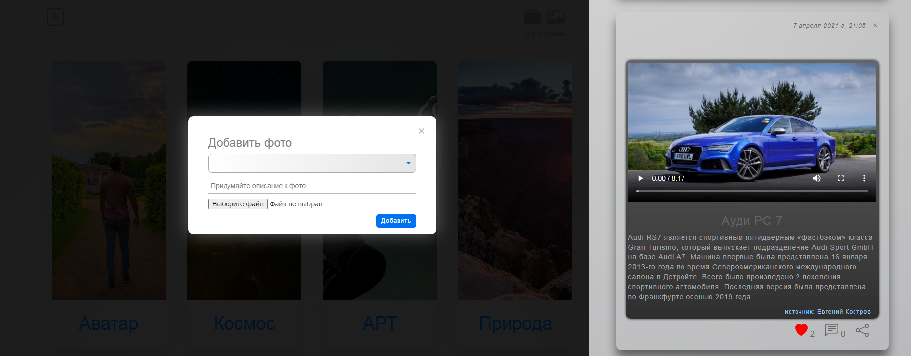

# Social-Network
Проект представляет из себя площадку для коммуникации пользователей между собой. 
Социальная сеть имеет набор привычных опций, создание постов, загрузка своего контента, будь то аудио, видео или фото файлы.
 
 

 
 
Любой пользователь может завязать диалог с интересующим его человеком.
 
 

 
 
В разделе аудио реализована смена цветовой гаммы заднего фона в зависимости от обожки альбома.
 
 

&nbsp&nbsp&nbsp&nbsp&nbsp&nbsp&nbsp&nbsp&nbsp&nbsp&nbsp&nbsp

 
 
Под каждым объектом с контентом есть стандартный набор кнопок, это оставить голос, либо комментарий или поделиться.
 
 

